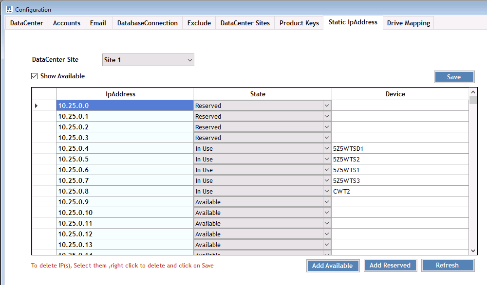
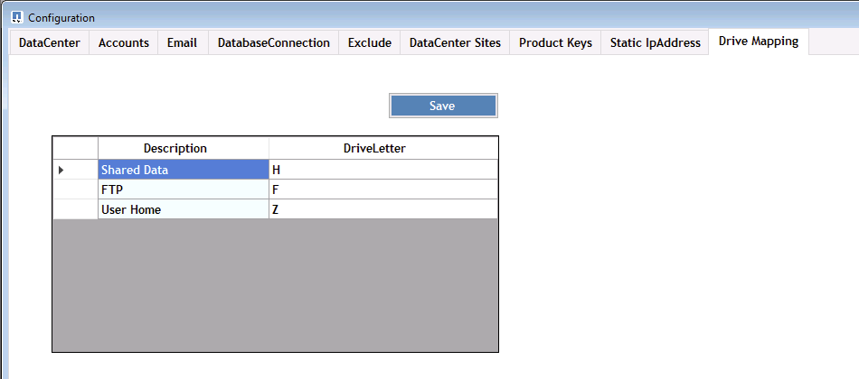

= 總覽
:allow-uri-read: 

== 總覽

DCConfig是CWMGR1 VM上的組態公用程式、用於設定及變更許多部署範圍的設定。

. 以管理員身分連線至CWMGR1 VM
. 從桌面捷徑執行應用程式

在應用程式中、有三個主要區段：組態、進階和說明。

=== 組態

「組態」視窗會在啟動時開啟、並有多個子區段

==== 資料中心

image::images/Management.dcconfig.dcconfig.overview-61c8f.png[management．dcsconfig．dcsconfig．overview 61c8f]

==== 帳戶

image::images/Management.dcconfig.dcconfig.overview-f34a2.png[management．dcsconfig．dcsconfig．overview f34a2]

==== 電子郵件

image::images/Management.dcconfig.dcconfig.overview-4b3be.png[management．dcsconfig．dcsconfig．overview 4b3be]

==== DatabaseConnection

image::images/Management.dcconfig.dcconfig.overview-80da7.png[management．dcsconfig．dcsconfig．overview 80da7]

==== 排除

image::images/Management.dcconfig.dcconfig.overview-0f30e.png[management．dcsconfig．dcsconfig．overview 0f30e]

==== 資料中心站台

image::images/Management.dcconfig.dcconfig.overview-95b21.png[management．dcsconfig．dcsconfig．overview 95b21]

==== 產品金鑰

image::images/Management.dcconfig.dcconfig.overview-298a0.png[management．dcsconfig．dcsconfig．overview 298a0]

==== 靜態IP地址

==== 磁碟機對應

=== 進階

「進階」視窗會顯示可在此介面中編輯的值清單。

[cols="33,33,33"]
|===
| 群組名稱 | FriendlyName | 價值 

| 群組名稱 | FriendlyName | 價值 

| 伺服器建立 | 更新VMNameWhenRemovedFromCache | 是非題 

| 伺服器建立 | 更新FireballRules | 是非題 

| 伺服器建立 | 等待重新開機 | <#分鐘> 

| 伺服器建立 | 等待超大規模建立 | <#分鐘> 

| 伺服器建立 | 等待後SysPrepMin | <#分鐘> 

| 伺服器建立 | 等待後SysPrepFor2008ServersMin | <#分鐘> 

| 伺服器建立 | GFI代理程式路徑 |  

| 伺服器建立 | 已啟用自動複製 | 是非題 

| 伺服器建立 | CompaniesOU | <字串- Companines OU Name> 

| 伺服器建立 | 安裝ThinstPrint v11 | 是非題 

| 伺服器建立 | 服務器OU | <字串-伺服器OU名稱> 

| 伺服器建立 | 安裝FsLogix | 是非題 

| 伺服器建立 | 使用預設OU | 是非題 

| 伺服器建立 | 最大執行緒數 | <#> 

| 伺服器建立 | 等待DNS更新分鐘數 | <#分鐘> 

| 檢查V直流工具版本 | 每X分鐘執行一次 | <#分鐘> 

| 每日行動 | 已啟用 | 是非題 

| 每日行動 | 在啟動時執行 | 是非題 

| 產生報告 | 時間 | <時間00:00> 

| 每日維護 | 已啟用 | 是非題 

| 每日維護 | 時間 | <時間00:00> 

| 每週維護 | 已啟用 | 是非題 

| 每週維護 | 時間 | <時間00:00> 

| 每週維護 | 天 | <一週中的某天> 

| 自動資源配置 | 已啟用 | 是非題 

| 資源配置 | 使用資料中心預設值 | 是非題 

| 電子郵件報告 | 包括電子郵件附件 | 是非題 

| 伺服器活動訊號 | 時間間隔（分鐘） | <#分鐘> 

| 下載AutoPro資料 | 時間間隔（分鐘） | <#分鐘> 

| 資料中心活動訊號 | 時間間隔（分鐘） | <#分鐘> 

| 伺服器重新開機 | 已啟用 | 是非題 

| 伺服器重新開機 | 重新開機之間的延遲時間（分鐘） | <#分鐘> 

| 自由空間報告 | MinFreeDeb空間GB | <# GB最低臨界值> 

| MaxRebootTimezhours | ClientServers | <#小時後需要重新開機> 

| MaxRebootTimezhours | InfrastrstructureServers | <#小時後需要重新開機> 

| 自動更新VDC-Tools | 已啟用 | 是非題 

| ActivateOffice | 已啟用 | 是非題 

| ActivateWindows | 已啟用 | 是非題 

| 監控 | 最長保留天數 | <#天> 

| 記錄 | 最長保留天數 | <#天> 

| 報告資料 | 最長保留天數 | <#天> 

| 檔案稽核 | 最長保留天數 | <#天> 

| 檔案稽核 | 詳細記錄 | 是非題 

| 檔案AuditFilers | 數字資料夾 | 2. 

| 檔案AuditFolder1. | 路徑 | [DataDrive]：\Data 

| 檔案AuditFolder1. | 排除 | * Thumbs.db 

| 檔案AuditFolder1. | 排除 | * 

| 檔案AuditFolder1. | 排除 | *~$*。doc 

| 檔案AuditFolder1. | 排除 | *~$*。docx 

| 檔案AuditFolder2. | 路徑 | [DataDrive]：\Home 

| 檔案AuditFolder2. | 排除 | thumbs.db 

| CwVmAutomationService | 服務命令列引數 |  

| FtpReleaaeAddress | URL | <FTP URL> 

| 工作負載排程 | 每X分鐘執行一次 | <#分鐘> 

| 工作負載排程 | 關閉快取公司 | 是非題 

| 建立備份 | 已啟用 | 是非題 

| 建立備份 | 每X分鐘執行一次 | <#分鐘> 

| 監控應用程式 | 已啟用 | 是非題 

| 筆 | 初始化休眠秒 | <#秒> 

| 筆 | MustChangel密碼 日 | <#天前的強制脈衝波重設> 

|  |  | <密碼重設文字字串> 

| 筆 | 標誌 | <本機.png-logo路徑> 

| 筆 | 數字通知日 | <#天> 

| 筆 | 通知第一天 | <#天前通知到期> 

| 筆 | 通知第二天 | <#天前通知到期> 

| 筆 | 通知第三天 | <#天前通知到期> 

| 筆 | 通知日4. | <#天前通知到期> 

| 筆 | 通知日5. | <#天前通知到期> 

| 筆 | 通知日6. | <#天前通知到期> 

| 監控 | 已啟用 | 是非題 

| 監控 | 傳送電子郵件警示 | 是非題 

| 監控 | 警示伺服器停機數分鐘 | <#分鐘> 

| 監控 | 警示RAM高數分鐘 | <#分鐘> 

| 監控 | RAM高% | <RAM %臨界值> 

| 監控 | 警示CPU上限數分鐘 | <#分鐘> 

| 監控 | CPU高% | <CPU %臨界值> 

| 監控 | 磁碟空間不足百分比 | <磁碟可用空間%臨界值> 

| 刪除用戶端延遲 | 分鐘 | <#分鐘> 

| 自動展開磁碟機 | 已啟用 | 是非題 

| 安全強化 | 已啟用 | 是非題 

| 以網域管理員的身分執行CwAgent | 已啟用 | 是非題 

| 監控伺服器 | 使用SolarWinds | 是非題 

| 自動更新H5入口網站 | 已啟用 | 是非題 

| 安裝萬用字元認證 | 基礎架構伺服器 | 是非題 

| 公司建立 | 在獨特的網站中 | 是非題 

| 即時擴充 | 最小延遲關機時間 | <#分鐘> 

| 伺服器資源報告 | 檢查DNS | 是非題 

| Hypervisor | 快取範本 | 是非題 

| 詳細記錄 | 即時擴充 | 是非題 

| 詳細記錄 | 即時擴充-顯示伺服器狀態 | 是非題 

| 詳細記錄 | 工作負載排程 | 是非題 

| 詳細記錄 | 從範本建立伺服器 | 是非題 

| 詳細記錄 | 從範本時間建立伺服器 | 是非題 

| 詳細記錄 | 從備份建立伺服器 | 是非題 

| 詳細記錄 | 從Clone建立伺服器 | 是非題 

| 詳細記錄 | 建立範本 | 是非題 

| 詳細記錄 | 與其他服務通訊 | 是非題 

| 建立範本 | 手動執行SysPrep | 是非題 

| 網域控制器 | 名稱 | cwmgr1.<domain.com 
|===
image::images/Management.dcconfig.dcconfig.overview-9c7ac.png[management．dcconfig．dcconfig．overview 9c7ac]

=== 說明

開啟本機說明檔案。
